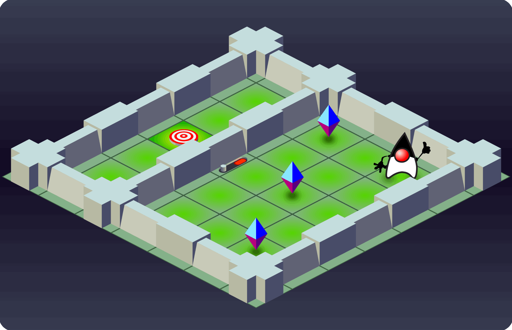

# The JGrounds App

## How to run the JGrounds App

### Requirements

- Java >= 11
- Internet connection (dependencies are downloaded automatically)
- IDE: [Gradle](http://www.gradle.org/) Plugin (not necessary for command line usage)

### IDE

Open the `JGrounds` [Gradle](http://www.gradle.org/) project in your favorite IDE (tested with IntelliJ 2019) and build it
by calling the `run` task.

### Command Line

Navigate to the [Gradle](http://www.gradle.org/) project (e.g., `path/to/JGrounds`) and enter the following command

#### Bash (Linux/OS X/Cygwin/other Unix-like shell)

    bash gradlew run
    
#### Windows (CMD)

    gradlew run

